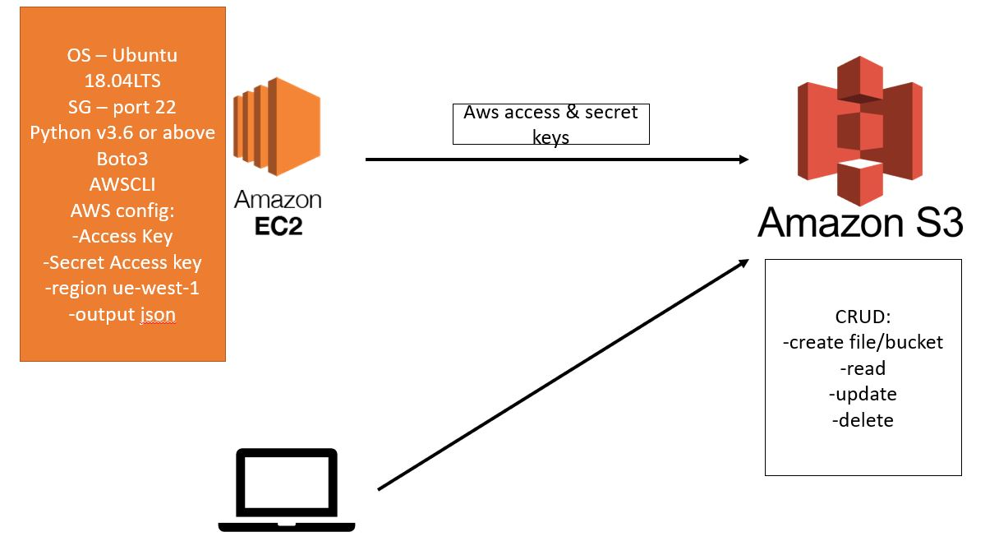

# Disaster Recovery plan

Disaster recovery is the process by which an organisation addresses any technology-related addresses. As IT systems can go down unexpectedly due to unforseen events, such as power outages, natural events, or security issues, company needs to have procedures and policies in place in order to recover quickly from such events.

Benefits of DR plan:
* Ensures business continuity - promts a quick restart of backup systems and data
* Enchances system security - data backups to the cloud have numerous built-in security features
* Improves customer retention - customer gains more confidence in business that can handle any disaster
* Reduces recovery costs - good DR plan reduces unnecessary losses as systems return back to normal in a short period of time

## S3

Amazon Simple Storage System (S3) is an object storage that offers industry-leading scalibility, data availability, security, and performance. 

Amazon S3 is an object storage service that stores data as objects within buckets. An object is a file and any metadata that describes the file. A bucket is a container for objects.

To store your data in Amazon S3, you first create a bucket and specify a bucket name and AWS Region. Then, you upload your data to that bucket as objects in Amazon S3. Each object has a key (or key name), which is the unique identifier for the object within the bucket.

## AWS CLI

AWS CLI is an open source tool that enables you to interact with AWS services using command in your command-line shell. 

## AWS SDK

AWS SDK is set of platform-specific tools for developers, such as debuggers, compilers and libraries, needed to create the code that runs on a specific platform, OS, or programming language.


## Create an EC2 Instance and connect to S3



1. Launch a new instance. Use `Ubuntu 18.04LST` version. In security groups ensure you allow `port 22` in order to be able to connect via ssh
2. Connect to your instance 
3. `sudo apt update -y` - update your EC2
4. `sudo apt upgrade -y` - install the updates
5. `sudo apt install python -y` - install python. It has to be `3.6` or above. You can use `python3 --version` in order to check what version you got installed
6. `sudo apt install python3-pip` - install python package manager
7. `alias python=python3` - ensure that Linux uses python3 version as default
8. `sudo python3 -m pip install awscli` - install `awscli` via python pip
9. `aws configure` - configure aws by adding the following:
    * enter AccessKey ID from file
    * enter Secret Key from file
    * enter region - `eu-west-1`
    * enter output type - `json`
10. type `aws configure` again to check if it saved the settings. Press `enter` without entering any data in order to skip and leave it unchanged
11. `aws s3 ls` - list the buckets inside the S3. Allows us to ensure that connection is establish. If it says `Access denied` it means configure file is incorrect and needs to be checked

## CRUD - Create, Read, Update, Delete
* `aws s3 mb s3://oleg-tech221`- make bucket
* `sudo nano test.txt` - create a test file on your EC2 instance
* `aws s3 cp test.txt s3://oleg-tech221` - upload file to s3, where:
    * `aws s3` - service we use
    * `cp` - copy
    * `test.txt` - file we want to upload
    * `s3://oleg-tech221` - destination where we want to upload to

* `aws s3 cp s3://oleg-tech221/test.txt /home/ubuntu` - copy file from S3 to your EC2 instance
* `aws s3 rm s3://oleg-tech221/test.txt` - delete the file from S3
* `aws s3 rb s3://oleg-tech221` - delete the bucket


## Using boto3

1. Start your new EC2 instance and connect it to S3 using all of the steps above (aws configure)
2. install boto3 - `pip3 install boto3`

### Create a butcket with boto3 script:

1. Create a new script using 'sudo nano create-bucket.py`
2. Enter the following code inside:

```
import boto3

client = boto3.client('s3')
s3 = boto3.resource('s3')

AWS_REGION = "eu-west-1"

client = boto3.client("s3", region_name=AWS_REGION)


bucket_name = "oleg-tech221"

location = {'LocationConstraint': AWS_REGION}

response = client.create_bucket(Bucket=bucket_name, CreateBucketConfiguration=location)

print("Amazon S3 bucket has been created")

```
3. Run script using `python3 create-bucket.py`
4. Use `aws s3 ls` to check if bucket is available. Or log in to AWS console and go to `S3` -> `Buckets` to search for your bucket

### Upload file to S3 using boto3

1. Create a test file, could be anything. In my example it is `sudo nano test.txt`
2. Create a new script using 'sudo nano upload-file.py`
3. Type the following code:
```
import boto3

client = boto3.client('s3')
s3 = boto3.resource('s3')

bucket_name="oleg-tech221"

s3.Bucket(bucket_name).upload_file('/home/ubuntu/test.txt', 'test.txt')

print('File uploaded')

```
4. Run script using `python3 upload-file.py`
5. Go to your AWS console, click on the bucket you created and check if file is inside

### Download file from S3 using boto3
1. Delete your test file from EC2 using `rm test.txt`
2. Create new script using `sudo nano get-file.py`
3. Type the following command:
```
import boto3

s3 = boto3.client('s3')
s3.download_file('oleg-tech221', 'test.txt', 'test.txt')

```
4. Run script using `python3 get-file.py`
5. Use `ls` to check if file was downloaded

### Delete file from S3 using boto3
1. Create a new scipt using `sudo nano delete-object.py`
2. Type the following command:
```
import boto3

client = boto3.client('s3')
s3 = boto3.resource('s3')

bucket_name="oleg-tech221"

s3.Object(bucket_name, 'test.txt').delete()

```
3. Run script using `python3 delete-object.py`
4. Go to your AWS console to check if file was removed from the bucket

### Delete bucket from S3 using boto3
1. Create a new scipt using `sudo nano delete-bucket.py`
2. Type the following command:
```
import boto3

client = boto3.client('s3')
s3 = boto3.resource('s3')

bucket_name="oleg-tech221"

response = client.delete_bucket(
        Bucket=bucket_name,
)


```
3. Run script using `python3 delete-bucket.py`
4. Go to your AWS console to check if bucket was removed


## S3 Storage classes
S3 storage classes - depending of how frequent you need to access the data storage you get a different storage class. more freqeuntly you access data storage more it will cost.