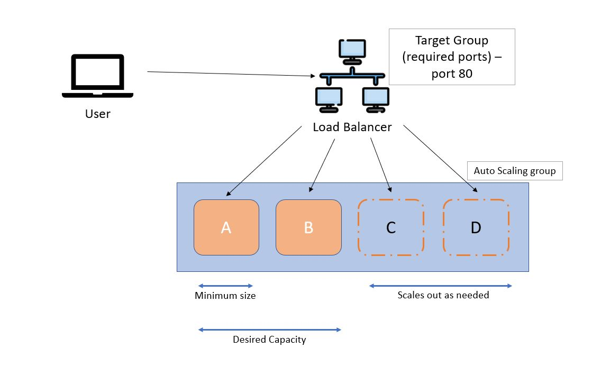

# Auto Scaling and Load Balancing

Auto Scaling allows us automatically adjust the size of the computational resources needed depending on the load.

Load Balancing distributes the traffic between the EC2 in order to ensure that none of the EC2 being overloaded.

There are two ways to do autoscaling:
* Scale out (horizontal) - meaning you add extra instances if required
* Scale up (vertical) - you add extra computation power if more resources required

Elements of Autoscaling and Load Balancing:

* First, we have a user who sends the traffic to the server. It gets intercepted by Load Balancer
* Load balancer has a Target Group set up, which checks if the traffic is allowed to go through or not. In our case, we use port 80 (HTTP) as required conncetcion in order to let the traffic through
* Load Balancer starts letting the traffic through to Auto Scaling Group.
* Auto Scaling group uses configurations set by us:
    * Instance template - we need to create an instance template first so ASG can create a multiple copies of the same instance with the same settings
    * Minimum size - what is the minimum amount of instances should be running as normal. Best practice is to use at least two, as if we have only one and it crashes our app will be down for some time until the new instance boots up
    * Desired capacity - desired amount of instances that should be running in the normal circumstances
    * Scale out as needed - how many instances more can be started in case of overload or crashing
    * Tracking Policy - we specify what conditions should be tracked in order to decide the healthy status of our instance. For example, it can track incoming or outgoing traffic, CPU overload, or how many users are trying to connect
    * Multiple AZs - its a good practice to run your instances on the different zones, so if one zone is unavailable then you will only lose one instance from that zone, and not all of them

So, with all the elements above, if we have an app running we will have a minimum of 2 instances running at any given time as a minimum size in order to ensure our app is fault proof. Every 300 seconds the system will check our instances to ensure if they are healthy, according to tracking policy. For example, if we set up tracking policy to "CPU load 50%", if any instance has a CPU load over 50% for over 300 consecutive seconds, then ASG will boot up a new EC2 instance to help to distribute the traffic and reduce the load. Once the traffic reduced and CPU load will be less than 50% then the scaled out instanced will be turned off and it will go back to having only two instance running as in desired settings.

