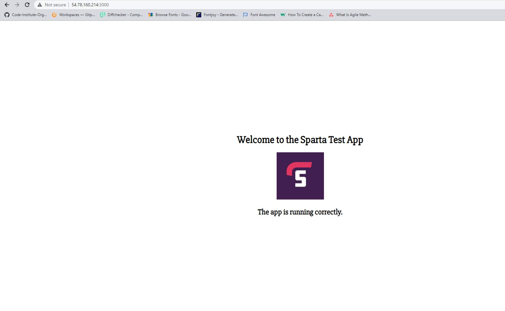
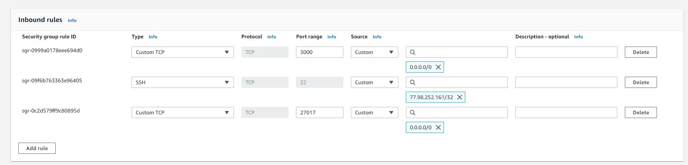

# Two-tier architecture in AWS

Copy app to your AWS instance:

1. Open two terminals: one connect to your AWS instance with ssh connection, another one use for your local machine
2. In your terminal for local machine write the following command `scp -i "tech221.pem" -r "d:/VisualStudio Projects/virtualisation/app" ubuntu@c2-54-78-160-214.eu-west-1.compute.amazonaws.com:/home/ubuntu`, where:
    * `scp -i ` - run a secure copy command
    * `"tech221.pem" -r`- telling to use an ssh key, have to be inside the .ssh folder
    * `"d:/VisualStudio Projects/virtualisation/app"` - destination to the app folder
    * `ubuntu@c2-54-78-160-214.eu-west-1.compute.amazonaws.com:/home/ubuntu` - destination to the EC2 machine

Install required dependancies

1. `sudo apt-get install python-software-properties` - install python software properties

2. `curl -sL https://deb.nodesource.com/setup_12.x | sudo -E bash -` - download a newer version of nodejs

3. `sudo apt-get install nodejs -y` - install nodejs on the EC2

4. `sudo npm install pm2 -g` - install pm2

Ensure SG allows port 3000

1. Select your instance and go into your Security Groups
2. Click on "Edit Inboud Rules"
3. Add a new rule:
    * Custom TCP
    * Set port to 3000
    * Source "IPv4 from anywhere (0.0.0.0)"
4. Save the rule

NPM install from the app folder location

1. `cd app` - navigate inside the app folder
2. `npm install` - install npm inside the app folder

NPM start

1. Run `node app.js` to start the app

App is available on port 3000

1. Copy the IPv4 address from your instance and paste it into the new tab in your browser
2. Add `:3000` at the end, so it looks like `http://54.78.160.214:3000/`
3. Your app should be running now




## Reverse Proxy

1. Use command `cd /etc/nginx/sites-available` in order to navigate inside the nginx configuration folder
2. Create a new configuration file with nano by using the following command: `sudo nano nodeapp.conf` (name could be anything, but try to make logical)
3. Inside the file type the following code:
```
server {
   listen 80;
   server_name <server name>;

   location / {
       proxy_pass http://<server name>:3000;
       proxy_set_header Host $host;
       proxy_set_header X-Real-IP $remote_addr;
       proxy_set_header X-Forwarded-For $proxy_add_x_forwarded_for;
       proxy_set_header X-Forwarded-Proto $scheme;
   }
}
```
`<server name>` - your EC2 IP address

4. Use `ctrl+x` to exit nano, then press `y` to save the changes, and then press `enter` to save the name of the file
5. Enable the configuration by creating a symbolic link to enable a new config file: `sudo ln -s /etc/nginx/sites-available/nodeapp.conf /etc/nginx/sites-enabled/nodeapp.conf`
6. Check configuration for errors `sudo nginx -t`
7. Reload nginx - `sudo systemctl reload nginx`
8. Enable nginx - `sudo systemctl enable nginx`
9. Go back to your home folder by using `cd` command and then navigate in to `cd app`
10. Launch app in the backgroun by using `node app.js &`
11. Paste your ip, without port number, into browser and check if it works:


## Creating new EC2 Instance for Database
1. Create a new EC2 Instance in your AWS account. 
2. For OS use Ubuntu 18.04 !! (20.04 doesn't let MongoDB being installed)
3. Change security group:
    * Add SSH connection with "MyIP" rule
    * Add "Custom TCP" connection with port "27017" for MondoDP and "IP from anywhere (0.0.0.0)"
    * Add "Custom TCP" connection with port "3000" for SpartaApp and "IP from anywhere (0.0.0.0)"

    


4. Click on "Launch Instance"
5. Connect to the Instance using SSH connection and GitBash terminal
6. Run following commands in order to install MongoDB on your instance:

```
sudo apt update -y 

sudo apt upgrade -y

sudo apt-key adv --keyserver hkp://keyserver.ubuntu.com:80 --recv D68FA50FEA312927

echo "deb https://repo.mongodb.org/apt/ubuntu xenial/mongodb-org/3.2 multiverse" | sudo tee /etc/apt/sources.list.d/mongodb-org-3.2.list

sudo apt update -y 

sudo apt upgrade -y

sudo apt-get install -y mongodb-org=3.2.20 mongodb-org-server=3.2.20 mongodb-org-shell=3.2.20 mongodb-org-mongos=3.2.20 mongodb-org-tools=3.2.20

sudo systemctl start mongod
```

## Connecting DB machine and App machine

On the DB Instance:
1. `cd` to home folder
2. `sudo nano /etc/mongod.conf` - open mongod configuration file
3. Scroll down, change `bindip` to `0.0.0.0`
4. Save file by pressing `ctrl+x` to exit, then `y` to save changes, and then `enter` to confirm
5. Restart mongod - `sudo systemctl restart mongod`
6. `sudo systemctl enable mongod` - enable autostart of mongo
7. `sudo systemctl status mongod` - ensure that mongo is running

On the App Instance:
1. Use `cd` to go back to home folder
2. `sudo nano .bashrc` - open .bashrc file to create your environment variable there
3. Scroll to the bottom and write export `DB_HOST=mongodb://<server>:27017/posts`, where:

    * `export DB_HOST` - creating an environment variable called DB_HOST
    * `mongodb://<server>:27017/posts` - telling machine to connect to mongodb database at the specific IP address that we have assigned in our DB Instance and to the page called posts
4. `source .bashrc` -restarts .bashrc file to apply changes

5. `cd app` - navigate inside the app folder

6. `node seeds/seed.js` - seed data to database

7. Run the app by using `node app.js &`

8. Type your `App Instance IP/posts` in the browser to check if posts page works and it takes the data from the mongodb


!!Important!!

* `lsof -i tcp:3000 $ kill -9 PID` - kill the process inside the port
* `export DB_HOST=mongodb://[ip of db instance]:27017/posts` - envirenment variable for app
* `ami-07b63aa1cfd3bc3a5` - Ubuntu 18.04 AMI
* `sudo lsof -i :3000` - check what processes are running on port 3000
