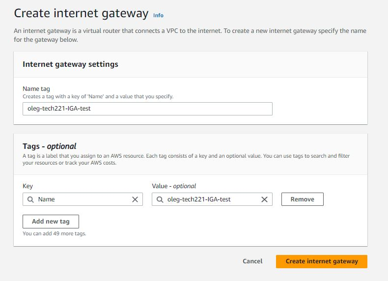

## What is VPC
* VPS is a virtual private cloud
* It is logically isolated virtual network that you can define
* It gives control over which IP addresses or applications can access resources

## Benefit of using VPC
* Agile - allows control over the size of your network
* Security - access is limited, until you grant it
* Affordability  - save money on hardware, labor and other cloud related resources
* Availability - it helps to decrease a downtime 

## Internet gateaway
* An internet gateway is a horizontally scaled, redundant, and highly available VPC component that allows communication between your VPC and the internet
* An internet gateway enables resources in your public subnets (such as EC2 instances) to connect to the internet if the resource has a public IPv4 address or an IPv6 address.

## Subnet
* A subnet, or subnetwork, is a network inside a network. Subnets make networks more efficient. Through subnetting, network traffic can travel a shorter distance without passing through unnecessary routers to reach its destination.

## Creating a VPC

### Step 1. Creat a VPC

1. On AWS Console website type `VPC` in the search bar and then in Services click on `VPC`
2. On the new page click on `Create VPC`
3. Complete the VCP settings as following:
    * `VPC Only`
    * `<your_name>-tech221-vcp` - name
    * `IPv4 CIDR` set to `10.0.0.0/16`
    * Rest you can leave as default

    

### Step 2. Create Internet Gateaway
1. On the left hand side panel search for `Internet gateaway`
2. In the new window click on `Create internet gateaway`
3. On the new page add name to your IGA and then click on `Create`

    

4. On the new page, once IGA is created, click on `Actions` and then on `Attach to VPC`

    

5. Search for VPC you would like to attach to and then click on `Attach internet gateaway`

    

### Step 3. Create a Route table
1. On the left hand side panel search for `Route tables`
2. Click on `Create route table`
3. On the new page:
    * give a name to your Route table
    * Chose a VPC

    
4. Now select your Route table and go to edit routes:

    

5. Add `0.0.0.0/0` route and `Save changes` in order to allow public access

6. Now create a new Route table for private access, but *without* adding `0.0.0.0/0` route!!!

### Step 4. Create a Subnet
1. On the left hand side panel search for `Subnets`
2. Click on `Create subnet`
3. On the new page:
    * Search for your VCP
    * Add a name to your subnet
    * Type in your IPv4 CIDR block
    * Click on `Create subnet`

    

4. Now, select your subnet and go to `Route table` -> `Edit route table association`

    

5. Select your RT and click on Save

    

6. Now repeat the steps by creating a new subnet for private network and attach it to Private RT

### Step 5. Create AMI for your App and DB Instances

1. Go to your running Instances
2. Select your `App` instance
3. Go to `Actions` -> `Images and templates` -> `Create Image`
4. Give your image a name and description(optional)
5. Click on `Create Image`
6. Repeat the same steps for `db` Instance

### Step 6. Create Instance from your AMI in your VPC
1. Click on `Launch instances`
2. Select your AMI
3. Edit your network settings as following:
    * For Public access:
        1. Select your VPC
        2. Select your Public subnet
        3. Enable Auto-assign Public IP
        4. Add SSH connection to "My IP"
        5. Add HTTP connection to "Anywhere"
        6. Add Custom TCP Port 3000 connection to "Anywhere"

    * For Private access:
        1. Select your VPC
        2. Select your Private subnet
        3. Disable Auto-assign Public IP
        4. Add Custom TCP Port 27017 connection to "Anywhere"

### Step 7. Connect your App and DB instances. Deploy the app
1. SSH into your App EC2
2. Change `DB_HOST` variable inside the `.bashrc` script to match the `private IP` from db EC2
3. Save the file and then use `source .bashrc` to restart the cript
4. `cd app` to navigate inside the app folder
5. `npm install` - to install the app
6. `node seeds/seed.js` - to seed to the database
7. `node app.js &` - to run app on the background
8. Enter `<publicip>:3000/posts` in order to see the Posts oage working